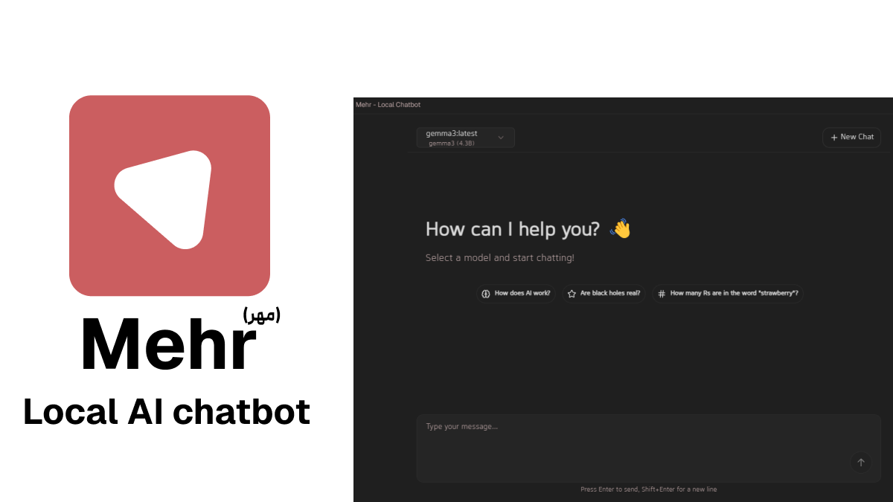

# Mehr 🌟

A modern, elegant local AI chatbot application that connects with Ollama to provide a seamless chat experience with various LLM models.

> **⚠️ Currently Windows Only**: This application is currently only available for Windows. Support for other platforms coming soon!

> ⭐ If you find this project helpful, please consider giving it a star! It helps others discover the project.



## Quick Install 📥

**Windows Users**: [Download the latest installer](https://github.com/xmannii/MehrLocalChat/releases/tag/v1)

Just download `MehrLocalChat-Setup.exe` from the releases page and run it to install Mehr on your Windows system.

> **⚠️ Known Issue**: Due to a current Vite limitation, the installer won't create a desktop shortcut automatically. You have two options:
>
> **Option 1: Pin to Taskbar (Recommended)**
> 1. Launch the app from Start Menu
> 2. Right-click the app icon in the taskbar
> 3. Click "Pin to taskbar"
> 
> **Option 2: Create Desktop Shortcut**
> 1. Pin to taskbar first (follow Option 1)
> 2. Right-click the pinned icon in taskbar
> 3. Right-click "Mehr" in the menu
> 4. Click "Properties"
> 5. Click "Open File Location"
> 6. Right-click the application and select "Create shortcut"
> 7. Move the shortcut to your desktop

## Features ✨

- 🤖 **Local AI Integration**: Connects with Ollama to run AI models locally on your machine
- 🌐 **Bilingual Support**: Full support for English and Persian (فارسی)
- 💅 **Modern UI**: Built with React, Electron, and shadcn/ui for a beautiful, responsive interface
- ✍️ **Markdown Support**: Rich text formatting in chat messages
- 🎛️ **Advanced Settings**: 
  - Temperature control for response creativity
  - Streaming support for real-time responses
- 💬 **Chat Features**:
  - Real-time message streaming
  - Message history within conversations
  - Markdown formatting support
  - Emoji support 🎉

## Template Credit 🙌

This project is built upon the excellent [electron-shadcn](https://github.com/LuanRoger/electron-shadcn) template, which provided the foundational structure for combining Electron with shadcn/ui. I've extended it significantly to create a full-featured AI chat application.

## Coming Soon 🚀

- 📚 Chat History
  - Save and organize your conversations
  - Browse through past chats
  - Create and manage multiple chat sessions
- 📄 Document Support
  - PDF file integration
  - Document analysis and Q&A
- 🖼️ Multimodal Support
  - Image understanding and generation
  - Enhanced media interaction

## Prerequisites 📋

1. [Ollama](https://ollama.com/) installed on your system
2. Node.js and npm/yarn installed (only needed for development)

## Installation 💻

### Option 1: Direct Download (Recommended for most users)
1. Download the [Windows Installer](https://github.com/xmannii/MehrLocalChat/releases/tag/v1)
2. Run `MehrLocalChat-Setup.exe`
3. Follow the installation wizard
4. **Important**: To create a desktop shortcut, follow the steps in the note above about the known Vite issue

### Option 2: Build from Source
```bash
# Clone the repository
git clone https://github.com/xmannii/MehrLocalChat

# Navigate to the project directory
cd MehrLocalChat

# Install dependencies
npm install

# Start the application
npm run start
```

## Usage 🎯

1. Start Ollama on your system
2. Launch Mehr
3. Select your preferred language (English/Persian)
4. Choose an AI model from your local Ollama installation
5. Start chatting!

## Settings ⚙️

You can customize your chat experience through the settings panel:

- **Language**: Switch between English and Persian
- **Theme**: Toggle between light and dark modes
- **Temperature**: Adjust the creativity level of responses (0.0 - 1.0)
- **Streaming**: Enable/disable real-time response streaming

## Development 🛠️

```bash
# Run in development mode
npm run start

# Build the application
npm run make


```

## Tech Stack 📚

- Electron
- React
- Vite
- TypeScript
- TailwindCSS
- shadcn/ui
- Ollama API
- i18

## Contributing 🤝

Contributions are welcome! Please feel free to submit a Pull Request.

## License 📄

This project is licensed under the MIT License - see the [LICENSE](LICENSE) file for details.

## Acknowledgments 🙏

- [Ollama](https://ollama.com/) for making local AI accessible
- [shadcn/ui](https://ui.shadcn.com/) for the beautiful UI components
- [electron-shadcn](https://github.com/LuanRoger/electron-shadcn) template for the project structure
- All contributors and supporters of the project

---

<div dir="rtl">

## مِهر - چت‌بات هوش مصنوعی محلی 🌟

مِهر یک نرم‌افزار مدرن و زیبا برای گفتگو با مدل‌های هوش مصنوعی است که به صورت محلی روی سیستم شما اجرا می‌شود.

### ویژگی‌های اصلی ✨

- پشتیبانی از زبان فارسی و انگلیسی 🌐
- رابط کاربری مدرن و زیبا 💅
- پشتیبانی از مارک‌داون ✍️
- تنظیمات پیشرفته برای خروجی‌های متنوع 🎛️
- پخش زنده پاسخ‌ها 💬
- پشتیبانی از ایموجی 🎉

به زودی: تاریخچه گفتگوها، پشتیبانی از PDF و قابلیت‌های چندرسانه‌ای 🚀

</div>
